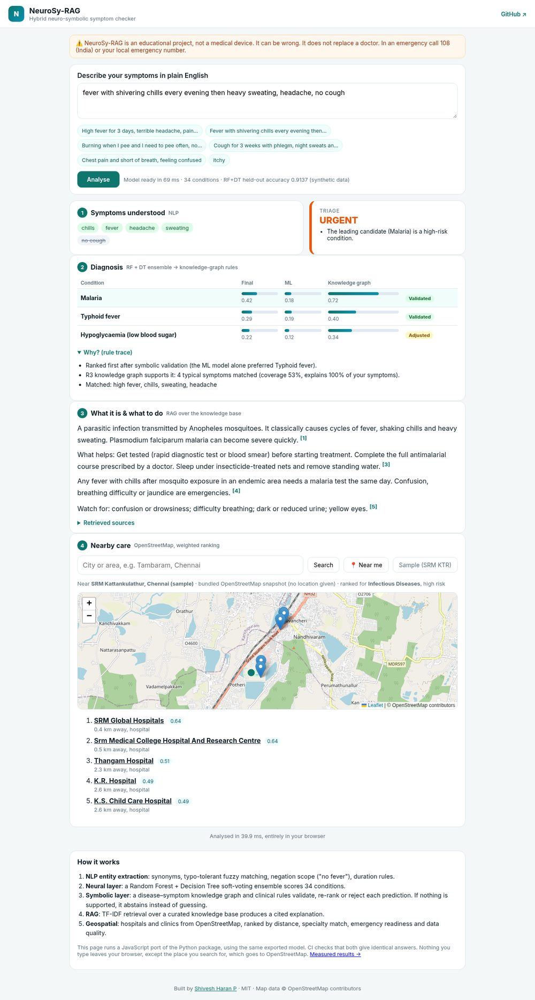
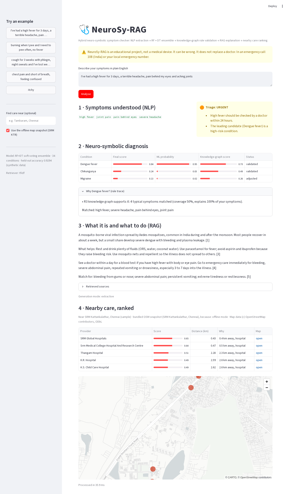
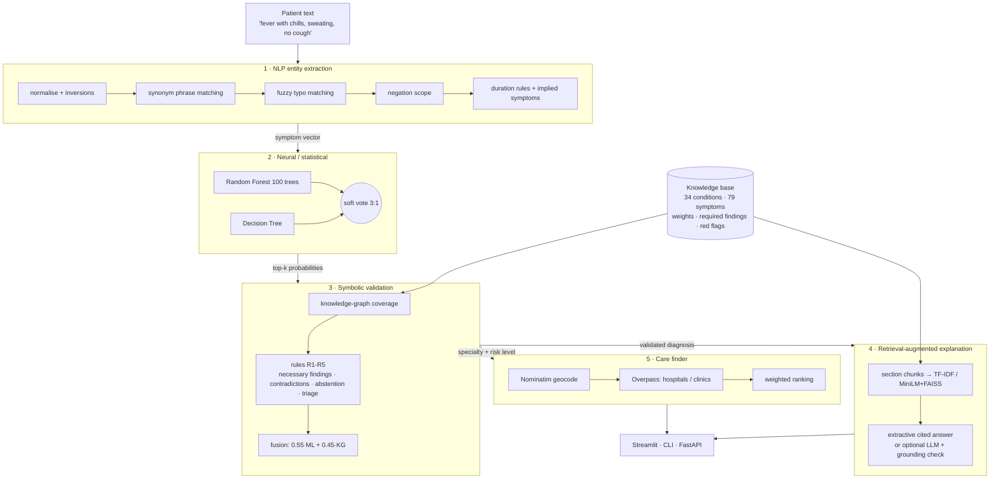

# NeuroSy-RAG: Hybrid Neuro-Symbolic Healthcare Assistant

### 🚀 Live demo: **https://shivesh900.github.io/neurosy-rag/**

Type symptoms (or tap an example) and you get the whole pipeline: extracted symptoms, triage, ranked diagnoses with the rule trace, a cited explanation, and ranked hospitals on a map (search any place, or use your location). It runs entirely in your browser.

> **Educational project, not a medical device.** It can be wrong and does not replace a doctor. In an emergency call **108** (India) or your local emergency number.

NeuroSy-RAG turns a plain-English symptom description into **explainable** condition suggestions:

1. **NLP entity extraction:** free text → structured symptoms, with negation ("no fever"), typo tolerance and duration rules.
2. **Neural/statistical layer:** a **Random Forest + Decision Tree** soft-voting ensemble (scikit-learn) proposes diagnoses.
3. **Symbolic layer:** a disease–symptom **knowledge graph** and a **deterministic rule engine** validate, re-rank or reject each proposal and explain why. When nothing is well supported, it **abstains** instead of guessing. This is the hallucination guard.
4. **RAG:** retrieves the matching sections of a curated medical knowledge base and writes a cited explanation (what it is, what helps, when to see a doctor). It works with **no API key**; an LLM is optional and is grounding-checked.
5. **Geospatial care finder:** finds nearby hospitals and clinics with the free OpenStreetMap APIs and ranks them by a **weighted score** (distance, specialty match, emergency readiness for the risk level, facility type, data quality).

There's a **Streamlit demo**, a **CLI**, a **FastAPI** service and an in-browser live demo. Everything runs on CPU in about 15 ms per query.

| Live web demo | Streamlit app |
|---|---|
|  |  |

## Architecture



### The neuro-symbolic part, concretely

| Rule | What it does | Example |
|---|---|---|
| **R1 necessary findings** | A condition is rejected if a required symptom group is missing | Dengue needs fever; UTI needs burning or frequent urination |
| **R2 contradictions** | Explicitly denied required symptoms reject the condition; denied hallmark symptoms cost 30% confidence each | "no fever" rules out malaria even if the model liked it |
| **R3 knowledge-graph coverage** | `0.6 × (weighted share of the disease profile observed) + 0.4 × (share of the patient's symptoms the disease explains)` | Low coverage marks the candidate "adjusted" |
| **R4 abstention** | If no candidate passes, the best combined score is < 0.30, or only one symptom was given, it says "insufficient evidence" | "itchy" → no diagnosis |
| **R5 triage red flags** | Emergency patterns override everything | chest pain + breathlessness → EMERGENCY |

Final score = `0.55 × ML probability + 0.45 × KG score` (× contradiction penalty) for every candidate that survives the rules. Each prediction comes with a human-readable rule trace.

Example. The ML model alone prefers typhoid, but the symbolic layer ranks malaria first because the knowledge graph explains all four symptoms (fever, chills, sweating, headache) and covers more of malaria's profile:

```
$ python -m neurosy.cli "fever with shivering chills every evening then heavy sweating, headache, no cough"
Symptoms understood: chills, fever, headache, sweating
Denied: cough

Condition                           Final     ML     KG  Status
Malaria                              0.42   0.18   0.72  validated
Typhoid fever                        0.29   0.19   0.40  validated
Hypoglycaemia (low blood sugar)      0.22   0.12   0.34  adjusted

Why (neuro-symbolic checks on the top suggestion):
  - Ranked first after symbolic validation (the ML model alone preferred Typhoid fever).
  - R3 knowledge graph supports it: 4 typical symptoms matched (coverage 53%, explains 100% of
  your symptoms).

Triage: [URGENT] urgent
  - The leading candidate (Malaria) is a high-risk condition.

About it (retrieved from the knowledge base, tfidf):
  A parasitic infection transmitted by Anopheles mosquitoes. It classically causes cycles of
  fever, shaking chills and heavy sweating. Plasmodium falciparum malaria can become severe
  quickly. [1]
  What helps: Get tested (rapid diagnostic test or blood smear) before starting treatment.
  Complete the full antimalarial course prescribed by a doctor. Sleep under insecticide-treated
  nets and remove standing water. [3]
  Any fever with chills after mosquito exposure in an endemic area needs a malaria test the same
  day. Confusion, breathing difficulty or jaundice are emergencies. [4]
  Watch for: confusion or drowsiness; difficulty breathing; dark or reduced urine; yellow eyes.
  [5]
  Sources: [1] Malaria - overview; [2] Malaria - symptoms; [3] Malaria - precautions; [4] Malaria - see doctor; [5] Malaria - red flags
```

## Quick start

```bash
git clone https://github.com/shivesh900/neurosy-rag.git
cd neurosy-rag
python -m venv .venv && source .venv/bin/activate      # Windows: .venv\Scripts\activate
pip install -r requirements-dev.txt

python scripts/train.py                                 # ~3 s: generates data, trains, saves models/ensemble.joblib
streamlit run app.py                                    # demo UI at http://localhost:8501
python -m neurosy.cli "burning when I pee and peeing often, no fever"
python -m neurosy.cli "high fever and joint pain" --place "Tambaram, Chennai"   # live OpenStreetMap search
uvicorn neurosy.api:app --reload                        # REST API, docs at http://localhost:8000/docs
```

The model also trains automatically on first use if `models/ensemble.joblib` is missing.

### API

```bash
curl -X POST localhost:8000/diagnose -H "Content-Type: application/json" \
     -d '{"text": "cough for 3 weeks with phlegm, night sweats and weight loss", "place": "Guindy, Chennai"}'
```

Returns the extracted symptoms, predictions (ML probability, KG score, final score, status, rule trace), rejected candidates, triage, the RAG explanation with sources, and ranked providers.

### Optional upgrades (no code changes)

| Feature | How |
|---|---|
| Dense retrieval | `pip install -r requirements-optional.txt` and `NEUROSY_EMBEDDINGS=1` (all-MiniLM-L6-v2 + FAISS) |
| LLM-written explanation | `NEUROSY_LLM_API_KEY=...` (any OpenAI-compatible endpoint; `NEUROSY_LLM_BASE_URL`, `NEUROSY_LLM_MODEL`). The answer is only used if every sentence passes the grounding check against the retrieved sources; otherwise the extractive answer is kept. |

## How the live demo works

GitHub Pages only serves static files, so `web/` contains a **JavaScript port of the pipeline** (`web/engine.js`): the same NLP rules (including a port of Python's `difflib` for typo matching), the same rules and fusion, TF-IDF retrieval and provider ranking. The trained scikit-learn ensemble is exported **tree by tree** to JSON (`scripts/export_web.py`, about 0.3 MB gzipped), so the browser computes exactly the same `predict_proba`.

`scripts/check_web_parity.py` runs all 51 vignettes plus edge cases through both engines. It requires identical symptoms, diagnoses, rule status, triage and explanation, with scores equal to within 0.001. It currently passes on 59/59. CI runs it, and the Pages workflow refuses to deploy if it fails.

The hospital search calls the free public OpenStreetMap servers (Nominatim for the place, Overpass for hospitals and clinics) straight from your browser. Those servers are shared and sometimes overloaded. When they don't answer, the demo says so and ranks a bundled OpenStreetMap snapshot around SRM Kattankulathur instead, so the ranking step always works.

## Data

- **Knowledge base** (`data/knowledge_base.json`): 34 common conditions (with an Indian context: dengue, malaria, typhoid, chikungunya, TB and others) and 79 symptoms with synonyms. Each condition has ICD-10 code, specialty, risk level, weighted symptoms, required findings, red flags, description, precautions and when to see a doctor. It was written for this project from general public-health information. It is a teaching resource, not clinical guidance.
- **Training data is synthetic** (`neurosy/data.py`). Patients are sampled from the knowledge-base profiles, with each symptom included at its prevalence, required findings guaranteed, and random noise symptoms added. It is seeded and reproducible. I chose synthetic data on purpose: the popular Kaggle symptom datasets have unclear licences and heavy duplication, where the same rows appear in train and test, which inflates accuracy to ~100%.
- **Map data:** OpenStreetMap via the Overpass and Nominatim APIs. An offline snapshot of providers around SRM Kattankulathur is bundled (`data/osm_providers_chennai_srm.json`, © OpenStreetMap contributors, **ODbL**).

## Results (measured: `python scripts/evaluate.py`)

```
1) Held-out synthetic split: ML ensemble accuracy 0.914 (34 diseases, 5100 synthetic patients, 80/20 stratified)

2) Hard synthetic patients (2-3 reported symptoms + 50% noise), n=1360
   ML only        : top-1 0.804   top-3 0.988
   Neuro-symbolic : top-1 0.849   top-3 0.998   abstained 1.3%   accuracy when it answers 0.860

3) Out-of-distribution (3 random unrelated symptoms), n=300
   ML alone still names a disease with mean top probability 0.37
   Neuro-symbolic abstains on 39.7% of them

4) Free-text vignettes end to end (NLP, ML, rules; used during development), n=34
   top-1 33/34 = 97.1%   top-3 34/34 = 100.0%   abstained 0   mean latency 13 ms (CPU)
   miss: expected influenza, got covid19: "high temperature, body aches all over, dry cough and totally exhausted"

5) Held-out free-text vignettes (written before tuning, never used to tune), n=17
   top-1 13/17 = 76.5%   top-3 14/17 = 82.4%   abstained 3   mean latency 18 ms (CPU)
   miss: expected dengue, got abstained (best guess covid19): "for two days I have had fever with severe body pain, my eyes hurt when"
   miss: expected tuberculosis, got bronchitis: "coughing for more than a month, sometimes blood in the sputum, lost ap"
   miss: expected gastroenteritis, got abstained (best guess gastroenteritis): "my child has watery diarrhea and vomited three times today"
   miss: expected uti, got abstained: "it burns when I urinate and there is blood in my urine"
```

How to read these numbers honestly:

- **They measure consistency with the knowledge base, not clinical accuracy.** The test patients come from the same generator as the training data. Real clinical validation would need real, consented patient records.
- On **incomplete, noisy inputs**, the symbolic layer **improves top-1 accuracy from 80.4% to 84.9%** (top-3: 98.8% → 99.8%) over the ML ensemble alone.
- On **nonsense inputs** (3 random unrelated symptoms), the ML model still names a disease. The rule layer **abstains on about 40% of them**. That is the hallucination-mitigation effect, measured.
- The **free-text vignettes** test the whole pipeline. The 34 development vignettes were used to grow the synonym list, so 97% there is optimistic. The **17 held-out vignettes**, written before tuning, give the more honest number: **76.5% top-1, 82% top-3**. The misses are instructive: "eyes hurt" isn't mapped to *pain behind eyes*, "it burns when I urinate" isn't recognised, and a month-long cough with blood was ranked bronchitis before TB.

## Project structure

```
neurosy/
  knowledge.py   knowledge-base loader, symptom implication graph
  nlp.py         symptom extraction (synonyms, fuzzy, negation scope, duration)
  data.py        synthetic patient generator
  model.py       RF + DT soft-voting ensemble (train / save / load)
  symbolic.py    knowledge-graph scoring, rules R1-R5, abstention, triage
  rag.py         chunking, TF-IDF / embedding retrieval, cited answers, grounding check
  geo.py         Nominatim + Overpass (with mirrors), weighted provider ranking, offline snapshot
  pipeline.py    end-to-end orchestration
  cli.py, api.py command line + FastAPI
app.py           Streamlit demo
web/             live demo: index.html, app.js, engine.js (JS port), model exported by CI
scripts/         train.py, evaluate.py, export_web.py, check_web_parity.py
data/            knowledge base, vignettes, OSM snapshot
tests/           pytest suite (NLP, rules, RAG grounding, geo ranking, API)
```

## Tests and CI

```bash
pytest -q
```

GitHub Actions runs the tests on Python 3.10 and 3.12, the full evaluation and the Python↔browser parity check on every push. A second workflow trains the model, exports it and deploys the live demo to GitHub Pages.

## Limitations and future work

- Replace the synthetic training set with a properly licensed clinical dataset and validate with clinicians.
- Learn symptom synonyms with embeddings, or use a clinical NER model (scispaCy / MedCAT), instead of a hand-written list. The held-out misses show why.
- Add age, sex, vitals, travel and season as features. Dengue vs chikungunya vs influenza often depends on them.
- Calibrate the fused score (Platt/isotonic) so it can be read as a probability.
- Multilingual input (Tamil, Hindi).

## License

Code: MIT (see [LICENSE](LICENSE)). The bundled OpenStreetMap extract is © OpenStreetMap contributors under the ODbL.
